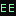

<div align="center">



# EE Curriculum

**Electrical engineering, for computer scientists.**

[](./LICENSE)
[](https://nextjs.org)
[](https://www.typescriptlang.org/)
[](https://pyodide.org)
[](https://ngspice.sourceforge.io)
[](./download/EE_Curriculum_for_Computer_Scientists.pdf)

[Curriculum](#curriculum) · [Interactive engines](#interactive-engines) · [Install](#install) · [Deploy](#deploy) · [Full Docs](docs/README-EXTENDED.md)

</div>

---

A rigorous 12-month, project-based master curriculum that takes a working computer scientist from Ohm's law to field-oriented motor control, FPGA prototyping, and grid-tied solar inverters — without skipping the math, the physics, or the bench time. Calibrated for ~12 months at 12 hours per week (~800 hours): DC/AC circuits, analog electronics, digital logic + embedded, signals + DSP, control + robotics, power electronics + machines, EM fields + RF, VLSI, and power systems + renewables.

Two deliverables ship together:

1. **A 97-page PDF workbook** — 11 phases, ~91 modules, ~140 lessons, ~52 hands-on projects, 6 capstones, checkpoints at the end of every module, and five appendices (toolchain setup, bill of materials, math reference, CS↔EE concept map, pacing calendar).
2. **An interactive learning site** (Next.js) — every hard concept wired to a running engine: real Python in the browser, two SPICE simulators, Verilog synthesis, live oscilloscope + FFT, WebSerial to real hardware, and more.

## Curriculum

| Phase | Topic | Weeks | Hours | Capstone |
|---|---|---|---|---|
| 0 | Foundations & Math Bridge | 4 | 48 | — |
| 1 | DC Circuit Analysis | 5 | 60 | — |
| 2 | AC Circuit Analysis | 5 | 60 | — |
| 3 | Analog Electronics | 6 | 72 | Audio Power Amp |
| 4 | Digital Logic & Embedded | 6 | 72 | FPGA FSM + STM32 SPI |
| 5 | Signals, Systems & DSP | 7 | 84 | Real-Time Audio EQ |
| 6 | Control Systems & Robotics | 6 | 72 | Line-Following Robot |
| 7 | Power Electronics & Machines | 7 | 84 | FOC BLDC Driver |
| 8 | EM Fields, RF & Communications | 6 | 72 | FM Transmitter + SDR |
| 9 | VLSI & IC Design | 5 | 60 | Pipelined Adder + NAND layout |
| 10 | Power Systems, Energy & Capstones | 8 | 120 | Pick 1–2 of 6 capstones |
| | | **65** | **~804** | |

The six Phase-10 capstones: FOC Motor Controller · Solar MPPT Inverter · Custom PCB Product · Robotics Platform with SLAM · Smart Grid Demo · SDR/RF Receiver.

The secret weapon is the **CS↔EE concept bridge** — every phase module opens with a callout naming the system you already know (FSM ↔ sequential circuit, convolution-as-image-filter ↔ convolution-as-LTI-system, pipelined CPU ↔ pipelined register design, hill climbing ↔ MPPT, LQR ↔ MDP…). Once you see the mapping, you learn EE 3–5× faster than a freshman would.

## Interactive engines

Everything runs in the browser — nothing installed, nothing leaves your device:

- **Python playgrounds** — [Pyodide](https://pyodide.org) (lazy ~10 MB CDN load) over ~14 DSP/control/RF lessons; 14 pre-built demos.
- **SPICE, twice** — `spicey` (pure-JS, instant-load) for simple circuits, `ngspice 46` WASM (5.7 MB) for transistor-level work with real device models; interactive Plotly waveform analysis.
- **Verilog in the browser** — [Yosys](https://github.com/YosysHQ/yosys) WASM synthesis → gate-level circuit visualization via digitaljs.
- **Visual circuit building** — embedded Falstad/CircuitJS1; KiCad schematics rendered via KiCanvas.
- **Signals you can hear** — signal generation through Web Audio with a live scope + FFT; WaveDrom for digital timing.
- **Real hardware & RF** — WebSerial to Arduino/ESP32/STM32; SDR spectrograms via IQEngine (SigMF).
- **Math** first-class — KaTeX formulas throughout, interactive Bode plots for transfer functions.

## Install

Prerequisites: Node.js 20+ (Bun preferred; npm/pnpm/yarn work). Python 3.11+ only if you re-render the PDF.

```sh
git clone https://github.com/srivtx/ee-curriculum.git
cd ee-curriculum
bun install
bun run dev
# → http://localhost:3000
```

Open a lesson with a playground badge (e.g. Phase 5 · Fourier Series) and run Python in the tab.

## Deploy

[](https://vercel.com/new/clone?repository-url=https%3A%2F%2Fgithub.com%2Fsrivtx%2Fee-curriculum&project-name=ee-curriculum&repository-name=ee-curriculum)

Import at [vercel.com/new](https://vercel.com/new), accept the Next.js defaults — build with `next build` (not the repo's standalone `bun run build`), install with `bun install`, zero environment variables, no database. Every push to `main` ships automatically. Netlify, Cloudflare Pages, Docker/VPS, and static export guides are all in [DEPLOY.md](DEPLOY.md).

## Docs

| | |
| --- | --- |
| [README-EXTENDED.md](docs/README-EXTENDED.md) | The deep version — CS↔EE bridge table, how to use the curriculum, PDF regeneration, full stack, repository layout, roadmap |
| [DEPLOY.md](DEPLOY.md) | Complete deployment guide — Vercel/Netlify/Cloudflare/Docker/static, post-deploy checklist |
| [DESIGN_SYSTEM_v3.md](research/DESIGN_SYSTEM_v3.md) | Design spec — hex codes, font tokens, component specs |
| [download/](download/) | The pre-built 97-page PDF workbook |

## Contributing

Contributions are welcome — the curriculum is opinionated but not dogmatic. Error reports, clearer explanations, missing concepts, and better projects are all fair game. Proof-reading the PDF, translating it (Hindi, Mandarin, Spanish, French), and adding hands-on projects for under-represented subfields (biomedical EE, audio, EV powertrains) are especially useful. Open an issue or PR, or read [docs/README-EXTENDED.md](docs/README-EXTENDED.md) for the maintainers' view.

## License

MIT — see [LICENSE](./LICENSE). The curriculum content, code, and PDF are all open: use them, fork them, teach with them, ship with them.
